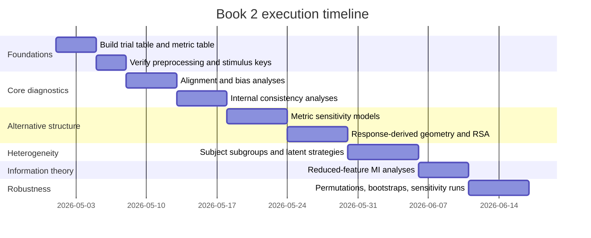
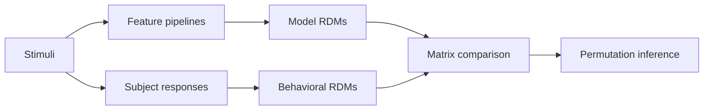

# Book 2 subject analyses for auditory categorization of Pearson-selected noise stimuli

## Executive summary

Your core inferential problem is not simply whether subjects were accurate by your experimenter-defined target and distractor split. It is whether their responses contain stable structure, and if so, whether that structure aligns with your Pearson-based labels, with some other acoustic organization, or with context-induced bias from having heard the real “wall” clip and example stimuli beforehand. The literature strongly supports treating these as separable questions, because auditory category learning depends on attention to dimensions, training variability, and task engagement, and because ambiguous auditory stimuli are highly susceptible to top-down expectations and criterion shifts. citeturn27view0turn27view4turn27view5turn28search2turn25view0turn26view3

For Book 2, the most informative analysis stack is: first, quantify alignment to your labels with signal-detection and mixed-effects models; second, quantify within-subject and between-subject response consistency; third, infer response-derived stimulus structure and compare it to Pearson space, spectro-temporal spaces, MFCC-DTW space, and other candidate perceptual spaces; fourth, test whether there are latent subject subgroups or latent strategy states. If poor performers are also inconsistent, guessing is plausible. If poor performers are internally consistent, or cluster into stable subgroups, then “wrong by your labels” is not the same thing as “uninformative.” citeturn11search2turn11search13turn4search19turn18view19turn12search7turn12search2turn12search0

Pearson correlation should remain in the analysis as the historical design baseline, because it defined your stimulus selection. But it should not be treated as the privileged perceptual metric. Work on speech and pronunciation distance, speech similarity spaces, and auditory perceptual distance all point toward spectro-temporal or embedding-based metrics with some degree of temporal tolerance as more realistic candidates for listener behavior than sample-wise waveform correlation alone. citeturn35view0turn35view1turn35view2turn32search3turn30search7

Mutual information is useful, but only if you reduce the feature space first and estimate carefully. High-dimensional MI estimation is difficult, KSG-type estimators are strongest in low and moderate dimensions, and mixed discrete-continuous settings require either a mixed estimator or a continuous latent response variable rather than raw binary responses fed directly into plain KSG. citeturn9search25turn18view17turn19search13turn19search4turn19search15turn23search2

The practical bottom line is this: Book 2 should be organized around a three-axis diagnosis of subject behavior, namely label alignment, internal consistency, and alternative-structure alignment. That framework gives you the cleanest path to distinguishing guessing from stable but misaligned category formation. citeturn11search2turn25view0turn26view2turn26view3turn12search7

## Focused literature review

Over the last two decades, auditory categorization work has emphasized that category learning is shaped by variability, intensity, and engagement rather than by a single fixed training recipe. A recent meta-analysis covering 111 experiments and 4,521 participants concluded that intensity and variability are the most robust predictors of learning success, while a complementary line of work shows that acoustic dimensions are often perceptually integral and hard to attend to selectively. Related neuroimaging work further suggests that speech sound categorization is not reducible to passive auditory encoding, because decision-making and auditory-motor regions also contribute to the eventual report. For your study, that means poor accuracy against your stimulus labels does not by itself imply absent structure; it may reflect which dimensions subjects latched onto, how strongly they did so, and whether those dimensions matched your design logic. citeturn27view0turn27view1turn27view3turn27view4turn27view5turn10search23

Noise-based auditory studies are especially relevant to your case. Repeated or structured acoustic noise can support rapid perceptual learning and memory traces even in the absence of salient acoustic landmarks, which means listeners can become sensitive to regularities you may not have explicitly intended. At the same time, ambiguous auditory stimuli are notoriously vulnerable to top-down priming. In a study of auditory pareidolia, contextual suggestion increased reports of hearing voices in ambiguous degraded speech, yet listeners showed low agreement on the actual content they believed they heard. In related work on hallucination-proneness and degraded speech, the most important distinction was not merely explicit priming, but whether listeners spontaneously drew on prior knowledge when faced with ambiguity. In your paradigm, the pre-exposure to the actual “wall” clip and example target and distractor stimuli therefore makes criterion and prior-driven categorization central, not secondary. citeturn18view5turn2search3turn25view0turn26view2turn26view3turn26view4

For uncovering what subjects may have attended to, the most relevant methodological literature comes from auditory reverse correlation, classification images, and bubble-noise methods. These approaches use paired stimulus-response data to estimate the acoustic regions or features that actually drive listeners’ decisions, with relatively weak a priori assumptions. Varnet and colleagues showed that auditory classification-image methods can identify fine acoustic cues relevant to speech decisions, while the more recent FastACI toolbox explicitly frames auditory reverse correlation as a way to recover the features listeners effectively used during noise-perturbed listening. Bubble-noise work in speech perception makes a similar point from a time-frequency perspective: subject behavior can reveal perceptually diagnostic regions even when the experimenter does not know them in advance. This logic transfers naturally to your study if you have trial-level responses. citeturn18view8turn18view9turn37search10turn37search11turn37search26

On the metric side, the literature argues for treating waveform correlation as a baseline rather than an endpoint. Bartelds and colleagues built an acoustic pronunciation distance measure from MFCCs, cepstral mean-variance normalization, and DTW, and reported a strong correspondence with human judgments of native-likeness. Their paper is especially useful for your problem because it shows both the value of temporal alignment and the need for careful preprocessing, while also documenting that such metrics remain sensitive to nuisance factors such as recording devices. More recent work on perceptual similarity spaces for speech using self-supervised representations, and on auditory feature-based perceptual distance, suggests that embedding-based spaces can capture perceptual structure more faithfully than raw signal or pixel-wise comparisons when complex sounds vary in time-frequency organization. citeturn35view0turn35view1turn35view2turn32search3turn32search9turn30search7

Mutual information is attractive because it measures nonlinear dependency without assuming linear correlation, but the estimation literature is clear that raw high-dimensional audio is a hostile regime for MI estimation. Kraskov, Stögbauer, and Grassberger introduced the landmark k-nearest-neighbor estimator, and later analysis showed that KSG performs well for broad classes of smooth distributions. At the same time, recent benchmarking and high-dimensional papers emphasize that no MI estimator is universally reliable from finite data, that KSG remains a strong baseline in low and medium dimensions, and that successful estimation in very high dimensions usually depends on the existence of a faithful low-dimensional latent representation. For your data, that means MI is best deployed on reduced spectro-temporal, MFCC, or embedding features, with stability checks across dimensionality, neighborhood size, and permutation nulls. citeturn9search25turn18view17turn19search4turn19search13turn19search15turn19search20

RSA is highly compatible with your scientific question because it shifts the analysis away from one metric at a time and toward whole representational geometries. The core RSA framework compares representational dissimilarity matrices across behavior and candidate models, and the toolbox literature emphasizes nonparametric inference and model comparison. In audition, RSA has already been used to characterize speech and sound-category representations in temporo-frontal pathways and in cortical maps. For Book 2, this is exactly the right logic for asking whether subjects’ behavioral geometry aligns best with your Pearson-defined category split, with spectro-temporal similarity, with MFCC-DTW, or with some other perceptual space. citeturn4search19turn18view19turn16search20turn18view22turn4search1turn4search15

Finally, the latent-strategy literature strongly supports moving beyond single-rule models. GLM-HMM work shows that what look like random lapses can reflect switching among discrete decision policies across trials, and nonparametric mixture modeling was developed specifically to disentangle hidden strategies in cognitive data. Latent class analysis serves a similar purpose at the population level by identifying recurring response-pattern types. For your experiment, these methods are the strongest way to ask whether there was one dominant response rule, several recurring subject-defined categories, or time-varying strategy shifts across the session. citeturn12search7turn12search20turn12search2turn12search6turn12search0

## Book 2 analysis blueprint

I assume a trial-level table with at least `subject_id`, `stimulus_id`, `response`, and optional `trial_index`, `block`, `rt`, and `confidence`. Sampling rate, exact clip duration, total number of trials, whether items were repeated within subjects, and whether every subject saw the same stimuli are unspecified, so the plan below is organized to degrade gracefully when some of those details are missing.

The key diagnostic frame is this:

| | High alignment to experimenter labels | Low alignment to experimenter labels |
|---|---:|---:|
| **High internal consistency** | Subjects learned your categories | Subjects formed a stable alternative rule |
| **Low internal consistency** | Weak or partial signal, noisy responding | Guessing or unstable decision policy |

That table is the conceptual center of Book 2.

| Book 2 chapter | Main question | Exact analyses | Statistical model | Core plots | Null model | Interpretation criterion |
|---|---|---|---|---|---|---|
| **Alignment and bias** | Are subjects sensitive to your target-distractor split at all? | Subject-level hit rate, false-alarm rate, d′, criterion C, balanced accuracy, AUC; group summaries and subject heterogeneity | Binomial mixed-effects model with experimenter label as predictor and random intercepts for subject and stimulus | Subject d′ forest plot, criterion distribution, ROC curve, response-rate by label | Permute target-distractor labels within subject while preserving target rate | d′ or AUC above permutation null implies some alignment; criterion shift with near-zero d′ implies bias without sensitivity |
| **Internal consistency** | Are responses stable within subject even when accuracy is poor? | If repeated items exist, repeat reliability and split-half; if not, response smoothness over nearest-neighbor stimulus graphs in each feature space; entropy of subject response vector | Bootstrap reliability, graph-smoothness test, optionally subject-specific regularized logistic models | Split-half scatter, reliability violin, subject-by-stimulus heatmap, response entropy histogram | Shuffle responses within subject while preserving number of positive responses | Consistency above null with low accuracy supports nonrandom but misaligned category use |
| **Metric sensitivity** | Which stimulus metric best predicts responses? | Compare Pearson, lagged cross-correlation, spectrogram correlation, MFCC distance, MFCC-DTW, embedding distance, and nuisance controls such as RMS and duration | Logistic mixed-effects model: response ~ metrics + nuisance + random slopes by subject | Coefficient forest, held-out AUC or log-loss comparison, marginal effect plots | Permute responses within subject or permute metric-stimulus mapping | A metric with clear held-out gain over Pearson is evidence that subjects used a cue family not captured by the design metric |
| **Response-derived stimulus geometry** | What category structure do responses imply? | Build subject-by-stimulus matrix; compute co-assignment matrix; hierarchical clustering, spectral clustering, MDS or UMAP for visualization; compare clusters to labels and metrics | ARI/NMI against experimenter labels; RSA or Mantel-style matrix comparison against model RDMs | Co-assignment heatmap, dendrogram, 2D embedding, block structure reordered by cluster | Subject-wise response permutation, bootstrap cluster stability | Stable blocks that align poorly with labels but well with an alternative metric imply subject-defined categories |
| **Subject subgroups and latent strategies** | Are there distinct subject types or latent response policies? | Cluster subjects on response vectors or on fitted cue weights; latent class analysis on reduced response summaries; mixture of logistic regressions; GLM-HMM if trial order exists | Finite mixtures, LCA, GLM-HMM with state-specific logistic kernels | Subject dendrogram, class posterior bar plots, transition matrices, state occupancy over time | Fit same models to subject-shuffled or trial-shuffled data | Stable classes or states mean performance averages are hiding heterogeneous strategies |
| **Representational similarity** | Does behavioral geometry match label geometry or another stimulus geometry? | Construct behavioral RDMs from responses or co-assignment; construct model RDMs from labels and metrics; compare using Spearman or Kendall RSA and partial RSA | Rank-correlation RSA, cross-validated regression RSA, permutation inference | RDM heatmaps, RDM correlation bar chart, partial RSA comparison plot | Stimulus-label permutation or subject-wise response permutation | Higher correlation with non-Pearson RDMs than with label RDM supports alternative perceptual organization |
| **Information content** | How much information about responses is carried by different reduced feature spaces? | MI between reduced feature representations and responses, subject-specific and pooled; compare feature families | KSG for continuous-continuous analyses, mixed kNN estimator for continuous features and binary responses | MI-versus-dimension chart, MI-versus-k stability chart, permutation-null histogram | Response permutation, feature-axis scrambling, bootstrap resampling | MI reliably above null indicates exploitable stimulus information; if MI exists in alternative features but not Pearson, your labels may be orthogonal to usable information |

A useful intermediate visual for the response-derived geometry chapter is an idealized co-assignment heatmap. If subjects formed categories, even idiosyncratic ones, you should see block structure rather than uniform fuzz:

```text
Example co-assignment matrix
        s1   s2   s3   s4   s5   s6
s1     1.0  0.8  0.7  0.2  0.1  0.2
s2     0.8  1.0  0.8  0.2  0.1  0.3
s3     0.7  0.8  1.0  0.3  0.2  0.2
s4     0.2  0.2  0.3  1.0  0.7  0.8
s5     0.1  0.1  0.2  0.7  1.0  0.8
s6     0.2  0.3  0.2  0.8  0.8  1.0
```

This section is grounded in the literature on categorization consistency, reverse correlation, RSA, and hidden-state strategy models. citeturn11search2turn18view8turn18view9turn4search19turn18view19turn12search7turn12search2

The execution order should be staged, because each later chapter depends on what the earlier ones reveal:



## Feature pipelines and metric comparison

Because your stimuli were selected from Pearson correlation to the waveform of the spoken word, every non-Pearson analysis should be reported relative to a Pearson baseline, not instead of it. The cleanest workflow is to maintain two parallel families of predictors: one family directly tied to the original design metric, and one family tied to alternative perceptual metrics. That makes it possible to say, for example, that subjects tracked Pearson rank weakly but tracked MFCC-DTW distance or spectrogram-space neighbors more strongly. citeturn35view0turn35view2turn32search3turn30search7

A practical preprocessing pipeline is as follows. Resample all files to a common rate, ideally 16 kHz for speech-focused work unless a higher rate is scientifically justified. Convert to mono, remove DC offset, and apply consistent RMS normalization while retaining RMS and duration as nuisance variables rather than discarding them. Trim or pad all stimuli to a common analysis window centered on the clip, but also record original duration because it can become a subject-visible cue. For spectrograms, use a 25 ms Hann window with 10 ms hop, `n_fft` around 512 at 16 kHz, plus a 40- or 64-bin log-mel representation. For MFCCs, a strong default is 13 coefficients plus delta and delta-delta, yielding 39 dimensions per frame. For DTW, use a constrained warping window such as a 10% to 15% Sakoe-Chiba band, because unconstrained DTW can align implausible fragments. For subject-level modeling, standardize all scalar metric predictors over stimuli before fitting. These recommendations follow well-established speech-feature and DTW practice and the more recent literature on perceptual similarity spaces and cue-sensitive preprocessing. citeturn35view0turn35view1turn35view2turn24search1turn24search13turn32search3

| Metric family | What it is likely capturing | Strengths | Main weaknesses | Perceptual relevance | Computational cost | Best role in Book 2 |
|---|---|---|---|---|---|---|
| **Waveform Pearson** | Zero-lag linear similarity of samples | Matches your design history; trivial to compute; interpretable | Extremely sensitive to alignment, phase, local amplitude, and codec artifacts | Low by itself | Very low | Mandatory baseline, not endpoint |
| **Lagged cross-correlation** | Linear similarity after simple temporal shift | Better than zero-lag Pearson for onset mismatch | Still waveform-level and still brittle for time warping | Low to moderate | Low | Secondary baseline |
| **Spectrogram correlation** | Similarity of time-frequency energy pattern | More perceptual than waveform; easy to visualize | Still sensitive to local shifts; depends on STFT settings | Moderate | Low to moderate | Good descriptive comparator |
| **MFCC Euclidean** | Broad spectral-envelope similarity | Compact, speech-oriented, classical | Loses fine temporal structure | Moderate | Low | Useful coarse speech proxy |
| **MFCC plus DTW** | Speech-like spectral content with temporal tolerance | Best classical candidate for short speech-like similarity; aligns variable timing | Can over-align if unconstrained; still partly nuisance-sensitive | Moderate to high | Moderate | Strong main alternative to Pearson |
| **Embedding cosine distance** | Learned perceptual neighborhood in feature space | Often more behaviorally plausible for complex speech similarity | Harder to interpret; depends on pretrained model | High, potentially | Moderate to high | Exploratory benchmark |
| **MI on reduced features** | Nonlinear dependence between features and responses | Captures dependence missed by correlation | Estimation unstable in high dimension; not itself a distance metric | Depends on features | Moderate to high | Information-content chapter, not primary selection metric |

The evidence base is strongest for MFCC-DTW among classical metrics, because it explicitly tolerates temporal mismatch and has been validated against human judgments after normalization. The modern embedding literature is promising for perceptual similarity, but it is best used as an exploratory benchmark rather than as the sole inferential basis for your first pass. MI belongs on top of reduced features, not on raw waveform samples. citeturn35view0turn35view1turn32search3turn30search7turn19search13turn19search15

If you want a clean Pearson-specific subanalysis, I would compute at least these four scalar summaries for every stimulus: signed Pearson to the original “wall” clip, absolute Pearson, local density in Pearson space among all selected stimuli, and distance to the target-distractor decision boundary implied by your actual cut. Those quantities let you ask whether subjects tracked the original design axis even if they did not reproduce the experimenter threshold exactly.

## Pseudocode and algorithmic recipes

The RSA logic for Book 2 is simple enough to visualize before coding:



**Subject consistency**

```python
# Inputs:
# Y[s, i] = binary response of subject s to stimulus i
# X[i, :] = feature vector for stimulus i in one candidate metric space
# repeated_mask[s, i] = True if repeated presentations exist

for subject in subjects:
    y = Y[subject]

    if repeated_items_exist(subject):
        # Repeat reliability
        y_rep1, y_rep2 = split_repeated_presentations(y)
        repeat_corr[subject] = corr(y_rep1, y_rep2)

        # Split-half reliability
        idx_a, idx_b = stratified_random_split(stimuli, by="label_or_metric_bin")
        fit_a = fit_regularized_logistic(X[idx_a], y[idx_a])
        pred_b = predict_prob(fit_a, X[idx_b])
        split_half_auc[subject] = auc(y[idx_b], pred_b)
    else:
        # Graph smoothness consistency
        G = k_nearest_neighbor_graph(X, k=10)
        same_neighbor = []
        for i in stimuli:
            nbrs = neighbors(G, i)
            same_neighbor.append(mean(y[i] == y[nbrs]))
        neighbor_consistency[subject] = mean(same_neighbor)

    # Response entropy
    p = mean(y)
    entropy[subject] = -(p * log2(p) + (1 - p) * log2(1 - p))
```

Interpretation is straightforward: high repeat or graph-based consistency with low alignment to experimenter labels is evidence for a stable nonexperimenter rule, not guessing. This is well aligned with recent work arguing that categorization consistency is an important individual-difference property in speech perception. citeturn11search2turn11search13

**Response-derived clustering**

```python
# Build co-assignment matrix across subjects
# C[i, j] = fraction of subjects assigning stimuli i and j to same category

C = zeros((n_stim, n_stim))
for i in range(n_stim):
    for j in range(n_stim):
        valid = nonmissing_subjects(i, j)
        C[i, j] = mean(Y[valid, i] == Y[valid, j])

D = 1.0 - C  # behavioral distance matrix

# Cluster stimuli
Z = hierarchical_clustering(D, method="average")
clusters = cut_tree(Z, k=2..8)

# Stability
for b in range(B):
    subj_boot = bootstrap_subjects(subjects)
    Cb = coassignment_matrix(Y[subj_boot, :])
    Db = 1 - Cb
    clusters_b = cluster(Db)
    ari_boot[b] = adjusted_rand_index(clusters, clusters_b)

# Compare to experimenter labels
ari_label = adjusted_rand_index(clusters, experimenter_labels)
nmi_label = normalized_mutual_info(clusters, experimenter_labels)
```

This operationalizes the “did subjects create categories, just not ours?” question directly, using the same logic that underlies auditory free-classification work. citeturn38search2turn38search3turn38search9turn38search10

**Logistic mixed-effects models linking metrics to responses**

```python
# Trial table columns:
# response, subject_id, stimulus_id, pearson_z, xcorr_z, spec_corr_z,
# mfcc_dtw_z, embed_dist_z, rms_z, duration_z, trial_index_z

formula = """
response ~ pearson_z + xcorr_z + spec_corr_z + mfcc_dtw_z +
           embed_dist_z + rms_z + duration_z + trial_index_z +
           (1 + pearson_z + mfcc_dtw_z + embed_dist_z | subject_id) +
           (1 | stimulus_id)
"""

fit = fit_binomial_mixed_model(formula, data=trial_df)

# Cross-validated comparison
models = {
    "pearson_only": [...],
    "classical_audio": [...],
    "learned_embedding": [...],
    "all_metrics": [...]
}

for name, cols in models.items():
    cv_scores[name] = grouped_cv_logloss(
        data=trial_df,
        predictors=cols,
        group_out=["subject_id", "stimulus_id"]
    )
```

This chapter is the empirical center of Book 2. If MFCC-DTW or an embedding predictor improves held-out performance over Pearson-only models, you have evidence that subjects tracked a cue family that your original selection metric missed. The preprocessing and normalization literature around MFCC-DTW is especially relevant here. citeturn35view0turn35view1turn35view2

**RSA matrix comparisons**

```python
# Model RDMs
RDM_label = binary_label_rdm(experimenter_labels)
RDM_pearson = pairwise_distance(metric_table["pearson_to_wall"])
RDM_mfccdtw = pairwise_distance(metric_table["mfcc_dtw"])
RDM_embed = pairwise_distance(metric_table["embedding"])

# Behavioral RDM from co-assignment or from subject-specific profiles
RDM_beh = 1 - coassignment_matrix(Y)

# Vectorize upper triangle
b = upper_tri(RDM_beh)
m_label = upper_tri(RDM_label)
m_p = upper_tri(RDM_pearson)
m_dtw = upper_tri(RDM_mfccdtw)
m_emb = upper_tri(RDM_embed)

# Standard RSA
rsa_corr = {
    "label": spearmanr(b, m_label),
    "pearson": spearmanr(b, m_p),
    "mfcc_dtw": spearmanr(b, m_dtw),
    "embedding": spearmanr(b, m_emb),
}

# Partial RSA
partial_mfcc = partial_rank_corr(b, m_dtw, controls=[m_label, m_p])
partial_label = partial_rank_corr(b, m_label, controls=[m_p, m_dtw])
```

RSA is the cleanest way to compare whole behavioral geometries instead of single scalar predictors. citeturn4search19turn18view19turn16search20

**Permutation tests**

```python
def permute_within_subject(y_by_subject, preserve_rate=True, preserve_block=True):
    y_perm = copy(y_by_subject)
    for s in subjects:
        if preserve_block:
            for block in blocks_of_subject[s]:
                idx = trial_idx[(subject == s) & (block_id == block)]
                y_perm[idx] = random_permutation(y_perm[idx])
        else:
            idx = trial_idx[subject == s]
            y_perm[idx] = random_permutation(y_perm[idx])
    return y_perm

T_obs = statistic_of_interest(Y, X, labels)

T_perm = []
for b in range(B):
    Yb = permute_within_subject(Y)
    T_perm.append(statistic_of_interest(Yb, X, labels))

p_value = (1 + sum(abs(T_perm) >= abs(T_obs))) / (B + 1)
```

For your experiment, subject-wise permutations that preserve each subject’s response rate are preferable to global shuffles, because they test structure over and above simple yes-bias or no-bias.

**MI estimation on reduced features**

```python
# For binary responses, use a mixed continuous-discrete estimator.
# If you insist on KSG, use it on a continuous latent response quantity,
# such as predicted target probability from a subject-specific model.

X_full = feature_matrix  # e.g. log-mel, MFCC summary, embedding
X_std = zscore(X_full)

# Reduce dimension first
pca = PCA(n_components=min(10, choose_by_cv_variance(X_std, target=0.90)))
Z = pca.fit_transform(X_std)

# Mixed estimator for binary responses
for subject in subjects:
    y = Y_subject[subject]  # binary
    mi_mixed[subject] = mixed_knn_mi(Z, y, k=5)

# KSG on continuous latent response proxy
for subject in subjects:
    yhat = subject_model_pred_prob[subject]  # continuous in [0,1]
    mi_ksg[subject] = ksg_mi(Z, yhat, k=5)

# Stability checks
for k in [3, 5, 10, 20]:
    for d in [2, 4, 6, 8, 10]:
        Zd = PCA(n_components=d).fit_transform(X_std)
        mi_grid[k, d] = estimate_mi(Zd, y)

# Permutation null
null = [estimate_mi(Z, permute(y)) for _ in range(B)]
```

The important rule is methodological, not ideological: reduce first, estimate second, and always report stability over neighborhood size, dimension, and permutation null. That is what the current MI literature supports. citeturn9search25turn19search13turn19search15turn23search2

## Software and prioritized reading

For implementation, I would use a compact stack rather than many overlapping toolkits. `librosa` is still the easiest way to compute spectrograms, log-mel features, MFCCs, and basic audio summaries; `SciPy` covers lower-level signal processing and statistics; `scikit-learn` gives you PCA, UMAP wrappers, clustering, cross-validation, ROC analysis, and kNN-based mutual-information scoring for mixed data types; `lme4` in R remains the cleanest workhorse for frequentist mixed-effects models; `brms` or `PyMC` are better when you want Bayesian multilevel models or richer uncertainty estimates; `rsatoolbox` is the most natural RSA environment; `JIDT` and `infomeasure` are the strongest broadly usable information-theory toolkits; `mclust`, `poLCA`, and `pROC` cover model-based clustering, latent class analysis, and ROC workflows cleanly. citeturn18view26turn20search3turn18view27turn20search4turn18view28turn34view0turn20search5turn16search24turn18view29turn23search13turn33view5turn33view6turn33view8

| Task | Recommended tools | Why these are the best fit |
|---|---|---|
| Audio preprocessing and feature extraction | `librosa`, `SciPy` | Standardized, transparent, and easy to audit |
| Classical metrics and distance matrices | `scipy.spatial`, `dtaidistance` or `dtw-python` | Fast pairwise distances and explicit DTW alignments |
| Mixed-effects models | `lme4`, `brms`, `PyMC`, optionally `statsmodels` | Reliable multilevel modeling with subject and stimulus random effects |
| Clustering and latent classes | `scikit-learn`, `mclust`, `poLCA` | Covers exploratory clustering and model-based subgroup discovery |
| RSA | `rsatoolbox` | Purpose-built for RDM construction, visualization, and inference |
| MI estimation | `JIDT`, `infomeasure`, `scikit-learn`, `NPEET` | Covers KSG-style and mixed-type estimation workflows |
| ROC, AUC, and threshold diagnostics | `pROC`, `scikit-learn` | Convenient inferential and visualization support |

Below is a prioritized reading list, ordered by payoff for Book 2 rather than by chronology.

- **Wang, N., et al. (2025). _Driving factors of auditory category learning success._** Review and meta-analysis of 111 experiments showing that training intensity and variability are the strongest predictors of auditory category learning success. citeturn27view0turn27view3
- **Obasih, C. O., Luthra, S., Dick, F., & Holt, L. L. (2023). _Auditory category learning is robust across training regimes._ _Cognition_, 237, 105467.** Useful corrective against overinterpreting one training manipulation, because learning can persist across multiple regime choices. citeturn28search2turn28search9
- **Roark, C. L., & Holt, L. L. (2019). _Perceptual dimensions influence auditory category learning._ _Attention, Perception, & Psychophysics_.** Particularly relevant for the idea that subjects may attend to dimensions different from the ones intended by the experimenter. citeturn10search18turn27view4
- **Nees, M. A., & Phillips, M. L. (2015). _Auditory pareidolia: Effects of contextual priming on perceptions of ambiguous auditory stimuli._ _Applied Cognitive Psychology_.** Critical for your paradigm because it shows that pre-task framing can increase “hearing” structure in degraded or ambiguous sounds while leaving content agreement low. citeturn25view0
- **Alderson-Day, B., et al. (2022). _Susceptibility to auditory hallucinations is associated with spontaneous, but not directed, use of top-down expectations in auditory signal detection._ _Neuroscience of Consciousness_, 2022, niac002.** Strong motivation for separating criterion, prior use, and actual sensitivity in your analyses. citeturn26view2turn26view3
- **Varnet, L., et al. (2013). _Using auditory classification images for the identification of fine acoustic cues used in speech perception._ _Frontiers in Human Neuroscience_, 7:865.** Best direct bridge from trial-level responses to inferred acoustic cues. citeturn18view8turn37search26
- **Osses, A., et al. (2025). _FastACI: a toolbox for investigating auditory perception using reverse correlation._ _Frontiers in Psychology_.** A practical entry point if you later want to estimate the cues subjects used from their choice data. citeturn18view9turn37search2
- **Bartelds, M., Richter, C., Liberman, M., & Wieling, M. (2020). _A New Acoustic-Based Pronunciation Distance Measure._ _Frontiers in Artificial Intelligence_, 3, 39.** Best classical reference for MFCC-DTW plus normalization as a human-relevant acoustic distance baseline. citeturn29search1turn35view0turn35view1
- **Chernyak, B. R., Bradlow, A. R., Keshet, J., & Goldrick, M. (2024). _A perceptual similarity space for speech based on self-supervised speech representations._ _The Journal of the Acoustical Society of America_, 155(6), 3915-3929.** Best modern argument for testing learned perceptual spaces against behavioral similarity. citeturn32search1turn32search14
- **Kraskov, A., Stögbauer, H., & Grassberger, P. (2004). _Estimating mutual information._** Foundational KSG paper, still the reference point for nonparametric MI estimation. citeturn9search25
- **Czyż, P., et al. (2023). _On the Evaluation of Mutual Information Estimators._** Important because it benchmarks MI estimators and argues that KSG remains a strong baseline in low and moderate dimensions. citeturn19search4turn19search13
- **Kriegeskorte, N., Mur, M., & Bandettini, P. A. (2008). _Representational similarity analysis: connecting the branches of systems neuroscience._ _Frontiers in Systems Neuroscience_, 2:4.** Foundational RSA paper, directly relevant to comparing behavioral and acoustic representational geometries. citeturn4search19
- **Nili, H., Wingfield, C., Walther, A., Su, L., Marslen-Wilson, W., et al. (2014). _A Toolbox for Representational Similarity Analysis._ _PLOS Computational Biology_, 10(4), e1003553.** Practical RSA inference and model-comparison reference. citeturn16search17turn18view19
- **Ashwood, Z. C., et al. (2022). _Mice alternate between discrete strategies during perceptual decision-making._** Best conceptual entry to GLM-HMM thinking, namely that low apparent performance can reflect strategy mixing rather than pure lapse noise. citeturn12search7turn12search20
- **Archambeau, K., et al. (2023). _Non-parametric mixture modeling of cognitive psychological data: A new method to disentangle hidden strategies._** Useful for hidden-strategy inference when behavior is heterogeneous and not well summarized by a single rule. citeturn12search2turn12search6
- **Sorgente, A., et al. (2025). _A systematic review of latent class analysis in psychology._** Good practical overview of LCA as a subgroup-discovery tool for response-pattern data. citeturn12search0

## Pitfalls and robustness checks

The first pitfall is equating poor accuracy with guessing. In your design, that is not warranted. Ambiguous auditory stimuli are shaped by prior exposure, category framing, and response criterion; recent work also suggests that consistency itself may be a meaningful subject trait. A subject who is “wrong” against experimenter labels but highly self-consistent or group-consistent is not behaving like a guesser. citeturn25view0turn26view2turn26view3turn11search2

The second pitfall is treating your Pearson-defined split as ground truth rather than as the design axis that generated the stimuli. Because Pearson was used for stimulus selection, it belongs in every model comparison. But interpretively it is one candidate geometry among several. The most defensible language is “experimenter-defined category structure” versus “response-defined category structure,” followed by explicit comparisons among spaces. citeturn35view0turn35view1turn4search19turn18view19

The third pitfall is attempting high-dimensional MI directly on raw waveform or high-resolution spectrogram vectors. The current estimation literature is explicit that dimensionality and finite sampling can break MI estimation, and that reliable estimation in large ambient dimensions typically depends on successful reduction to a smaller latent space. The robustness checks here are nonnegotiable: vary PCA dimensionality, vary `k`, compare to permutation nulls, and report bootstrap confidence intervals. citeturn18view17turn19search4turn19search13turn19search15

The fourth pitfall is overinterpreting visual embeddings such as UMAP or MDS. Use them for communication and inspection, not as primary inferential evidence. The inferential burden should fall on held-out predictive performance, permutation-tested RSA, cluster stability, and class-posterior stability. citeturn20search2turn20search10turn18view19

The fifth pitfall is failing to model nuisance structure. In short word-like or noise clips, RMS level, duration, onset sharpness, compression artifacts, and order effects may all become subject-visible cues. Every main response model should therefore include nuisance covariates and trial index, and every permutation scheme should preserve subject-level response rates and, when applicable, block structure. citeturn25view0turn35view1turn26view2

The sixth pitfall is letting correlated predictors blur interpretation. Pearson, cross-correlation, spectrogram correlation, and MFCC-based distances will not be independent. The best defense is a staged model-comparison workflow: fit one-metric models first, then families of metrics, then combined models with regularization or principled variable selection, and always evaluate out of sample. That workflow also makes it easier to explain whether an apparent “better metric” is adding information or merely re-expressing Pearson. citeturn35view0turn35view2turn19search4

The strongest robustness package for your study is therefore:

- rerun all main results under at least two preprocessing pipelines;
- compare Pearson-only, classical-feature, and embedding models under grouped cross-validation;
- quantify both alignment and internal consistency for every subject;
- bootstrap response-derived clusters and latent classes;
- run permutation tests that preserve subject response rates and block structure;
- rerun MI across multiple dimensions and neighborhood sizes;
- report cases where conclusions change across metrics rather than suppressing them.

If those checks all point the same way, then you will be in a strong position to say not only whether subjects succeeded, but what kind of structure was actually available to them and whether it matched the structure you intended.